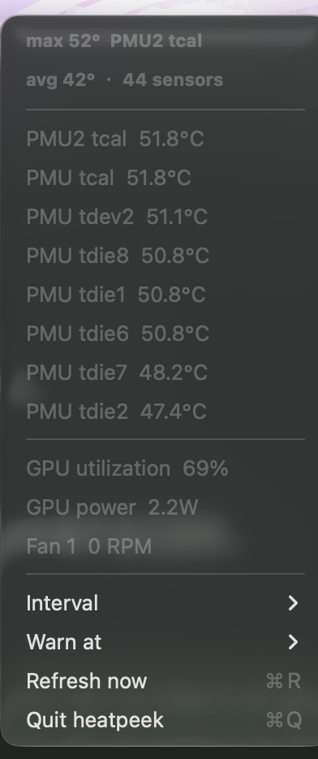

# heatpeek

A menu bar readout of what a Mac is *feeling*: SoC temperature, GPU utilization,
GPU power, and fan speed.

```text
55°  38%  1.9W  2506r
```

The temperature turns red at a configurable threshold (85 °C by default).



Zero dependencies: no package manager, no bundled libraries, no build step
beyond `swift build`. Every figure comes from the kernel through IOKit, so
nothing shells out to `powermetrics` or `nettop`.

heatpeek deliberately does not report CPU load, memory pressure, disk or
network throughput — that is
[xnumeter](https://github.com/AyaseEli-Bing/xnumeter)'s job. This project only
covers the sensor side, which needs different (and partly private) APIs.

## Requirements

- macOS 13 or later on **Apple Silicon**. Everything here is measured on an
  M4 (Mac16,1) running macOS 27; Intel Macs expose different sensor keys and
  are untested.
- No root, no entitlements, no sandbox exception. All three sources are
  readable by an ordinary user process.

## Build

```bash
make app        # release build -> dist/HeatPeek.app (ad-hoc signed)
swift build     # debug build -> .build/debug/heatpeek
```

Prebuilt: [Releases](https://github.com/AyaseEli-Bing/heatpeek/releases) carries
`HeatPeek-<version>-macos-apple-silicon.zip` with a `SHA256SUMS` next to it. Apple Silicon only.

Because a free Apple ID cannot issue a Developer ID certificate, releases are
ad-hoc signed and cannot be notarized. The first launch of a downloaded build
may need:

```bash
xattr -dr com.apple.quarantine dist/HeatPeek.app
```

## Use

Run the app; it lives in the menu bar with no Dock icon. The four fields are
hottest sensor, GPU utilization, GPU power, and fan speed. A source that is
unavailable renders as `--` and explains itself in the menu.

Click the item for the eight hottest sensors, GPU figures, per-fan RPM, the
refresh interval (1/2/5/10 s), and the warning threshold (80/85/90/95/100 °C,
or never).

The same readings are available for scripts:

```bash
$ heatpeek --once
temperature  max 56.8°C  (PMU tdev2)
temperature  avg 46.7°C  (44 sensors)
gpu          utilization 80%
gpu          power 1.57W
fan          Fan 1 2502 RPM
```

```bash
$ heatpeek --once --json
{
  "fans" : [ { "name" : "Fan 1", "rpm" : 2506.19580078125 } ],
  "gpuPowerWatts" : 1.6341884174007515,
  "gpuUtilizationPercent" : 67,
  "temperatures" : [ { "celsius" : 51.64, "sensor" : "PMU tdie14" } ],
  "timestamp" : "2026-10-04T15:20:41Z",
  "unavailable" : { }
}
```

`--once` exits 0 even when a source is missing, so a dashboard can tell
"unavailable" apart from "heatpeek crashed". The JSON shape does not depend on
the hardware: a source that cannot be read is `null`, and the reason appears
under `unavailable`.

`--version` prints the version and `--help` (or `-h`) prints the usage text;
both exit 0 without taking a reading. An unknown argument is the exception to
the exit-0 rule: heatpeek writes `unknown argument` and the help text to stderr
and exits 64 (`EX_USAGE`), so a mistyped flag fails loudly instead of printing a
readout.

## What it reads

| Field | Source | Privilege |
| --- | --- | --- |
| Temperature | `IOHIDEventSystemClient*`, usage page `0xff00` / usage `0x0005`, event type 15 | user |
| GPU utilization | `IOAccelerator` registry property `PerformanceStatistics` | user |
| GPU power | `IOReport` group `Energy Model`, channel `GPU Energy` | user |
| Fan speed | `AppleSMC` user client, keys `F0Ac`…`F5Ac` | user |

The HID and IOReport entry points have no public headers. heatpeek resolves
them with `dlopen`/`dlsym` rather than shipping a private bridging header, so
`swift build` works with a stock toolchain.

Temperature is reported as the hottest of the ~44 exposed sensors rather than
a single "CPU temperature", because Apple publishes no such thing on Apple
Silicon: the sensors are named `PMU tdie*` and `PMU tdev*`, and which one
tracks the load changes with workload.

Each HID sensor costs about a millisecond of IPC, so a full sweep is ~50 ms —
which made a 2 s menu bar tick the app's entire CPU cost. Temperature is
therefore sampled at most every 5 s (`SampleCache`) while GPU and fan follow
the interval you pick. Measured on M4: 51 ms on a refresh tick, 4–5 ms on a
cached one.

Fan speed is read through the public `IOConnectCallStructMethod`, and the
`flt ` payload is **little-endian** IEEE-754. Decoding it big-endian turns
2530 RPM into `7.3e-36`, which is the kind of bug that reads as "the fan is
stopped" for weeks.

## Known limits

- **No CPU power.** On M4 the `mJ` counters in `Energy Model` (`CPU Energy`,
  `ECPU0…5`, `PCPU0…3`, `ANE`, `DRAM`) stay a static snapshot when polled,
  while only the `nJ` `GPU Energy` channel advances. Getting the CPU figure
  needs a stream callback this project does not implement yet.
- **The fan reads 0 RPM at idle, for a long time.** On the test machine 10
  busy threads held 0 RPM while the hottest sensor climbed from 52 °C to
  68 °C over 100 s, then it spun up to ~2500 RPM. That is the machine's
  thermal policy, not a missing reading — values outside `0…15000` are
  discarded.
- **GPU utilization is not comparable with Activity Monitor.** The kernel
  counter includes window-server work, so an idle desktop can report 60–80 %.
  Treat it as a trend, not a percentage of "your" work.
- `ProcessInfo.processInfo.thermalState` stayed `nominal` throughout testing
  and is not used.
- No historical graphs, no per-process attribution, no automatic updates.
- If the menu bar is already full, macOS clips new items behind the overflow
  chevron and heatpeek will not be visible.

## Tests

```bash
make test           # unit tests + quick selftest
make selftest-full  # adds a 25 s load test that asserts temperatures rise
```

`scripts/selftest.sh` cross-checks GPU utilization against `ioreg` and skips
(rather than fails) hardware assertions on machines without sensors, so the
same script runs on a CI runner.

## Contributing

See [CONTRIBUTING.md](CONTRIBUTING.md) for the build-and-verify loop. Tasks marked
[`good first issue`](https://github.com/AyaseEli-Bing/heatpeek/labels/good%20first%20issue) are
self-contained and verifiable without special hardware — comment on one to claim it before you
start.

## License

MIT — see [LICENSE](LICENSE).
